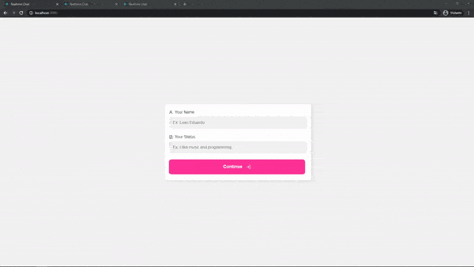

# :speech_balloon: Realtime Chat With React and Node

This project was created to learn more about Web Sockets and realtime applications using **Node** and **React**.

The main idea of the project is very simple: the user sign in with a name and a status, choose another user and start a conversation with him. Programming something like this is not as easy as may seem, but there are many tutorials out there to learn everything that is needed for this project.



## :zap: Technologies

**Back-end**

- TypeScript
- Node
- Express
- Socket IO Server
- Eslint
- Prettier

**Front-end**

- TypeScript
- React
- Styled Components
- Eslint
- Prettier
- Socket IO Client
- date-fns

## :rocket: What I Learned With This Project

1. Socket.io is a very easy and powerful library. When you understand how it works everything become easy.
2. The combination of React + Node + TypeScript is very powerful and productive.

## :information_source: How To Use

To clone and run this application, you'll need the latest version of [Git][git], [Node.js][nodejs] + [Yarn][yarn] installed on your computer.

Then run these comands on the terminal:

```bash
# Clone the project from GitHub
$ git clone https://github.com/LuanEdCosta/react-node-realtime-chat.git

# Go into the project folder
$ cd react-node-realtime-chat

# -- Now open two terminal tabs or windows --

# In the first terminal run
$ cd website
$ yarn install
$ yarn start

# In the second terminal run
$ cd backend
$ yarn install
$ yarn dev
```

---

## :man: Author

Luan Eduardo da Costa | [Follow me on Linkedin](https://www.linkedin.com/in/luaneducosta/)

[git]: https://git-scm.com
[nodejs]: https://nodejs.org/
[yarn]: https://yarnpkg.com/
